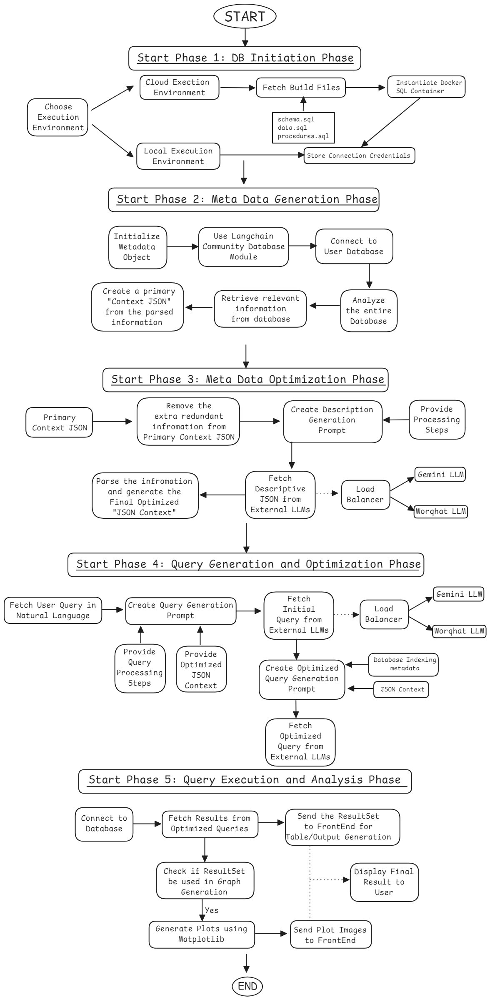

### Query Cortex

This project was made for the `Pulzion Web n App Hackathon`

Team Members:
- Tirthraj Mahajan
- Amey Kulkarni
- Vardhan Dongre

### Problem Statement: Database-Driven Q&A with Dashboard Visualization

__Description of Problem:__

Accessing and analyzing data stored in databases often requires specialized knowledge of query
languages (e.g., SQL) or reliance on pre-built reports. This limits the ability of non-technical users
to explore data and gain insights independently. Additionally, presenting data in static formats like
tables can hinder understanding and engagement.

__Abstract:__

Develop a solution that enables users to interact with databases using natural language
questions and receive insightful answers. The solution should leverage natural language
processing (NLP) to understand user queries, optimize database access using indexing or similar
techniques, and generate concise answers. Furthermore, the solution should have the capability
to transform database query results into interactive charts and dashboards, enhancing data
visualization and exploration.

__Core Functional Requirements__

1. Natural Language Interface: Develop an interface for users to input questions about
the database in natural language.
2. Query Translation: Implement NLP techniques to translate natural language queries
into SQL or similar database queries.
3. Answer Generation: Retrieve relevant data from the database and generate concise
answers to user queries.
4. Data Visualization: Create charts or graphs to represent query results visually.
5. Dashboard Customization: Allow users to customize the layout, appearance, and
interactivity of the generated dashboards.
6. Database Indexing and Optimization: Implement indexing or similar techniques to
optimize database access and retrieval, ensuring fast response times even for complex
queries.

__Non-Functional Requirements__

1. Usability: Ensure the interface is intuitive for non-technical users.
2. Performance: Provide reasonably fast response times for queries and visualizations.
3. Accuracy: Maintain a good level of accuracy in query interpretation and data retrieval.

__Potential Extensions (if time allows)__
● Support for multiple database types (e.g., SQL, NoSQL)
● Advanced dashboard customization features
● AI-powered insights and recommendations based on data analysis
● Integration with existing business intelligence tools
● Collaboration features for sharing dashboards and insights

### Our Idea:

Here is the system architecture of our solution

### Output Images:

1. This is the chat application in web

When you provide a prompt, it will give you the SQL query which is generated and also the output table

2. These are the Insights and the graphs which get generated once you get back the results

3. Currently the user can choose which LLM they want to choose from

In the future, you can do this on the backend by load balancing across multiple llms depending on the type of prompts

4. You can connect to your local postgres database or upload the replication file to deploy the postgres onto our servers

5. Our system has the ability to generate and run very complex queries

6. Our application provides the ability for the users to execute multiple queries using a single prompt

### How to run the project

#### 1. Install Dependencies
1. Python 3 or above
2. Node Js version 20 or above
3. Docker
4. PostgreSQL

### 2. Start up the Query Processing service

Goto <a href=""> Query Processing Service Docs </a> and start the Fast API Server

### 3. Start up the Database and Chat Creation Service

Goto <a href=""> Database and Chat Creation Service Docs </a> and start up the Flask Server

### 4. Start up the Next Js Server

Goto <a href=""> Frontend NextJs Docs </a> and start up the Next JS server

